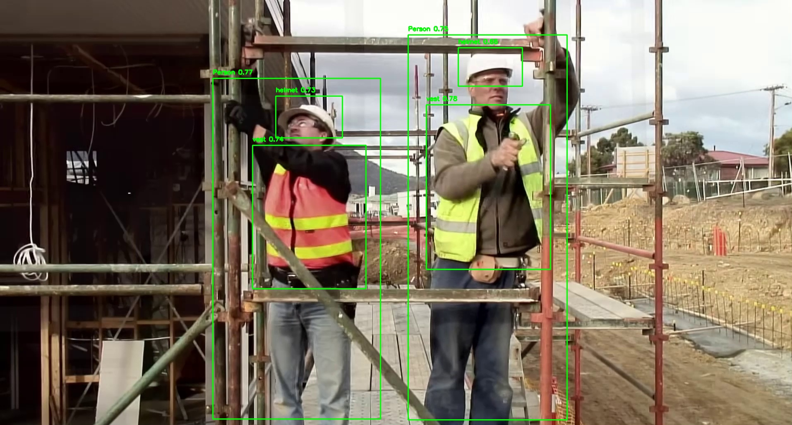
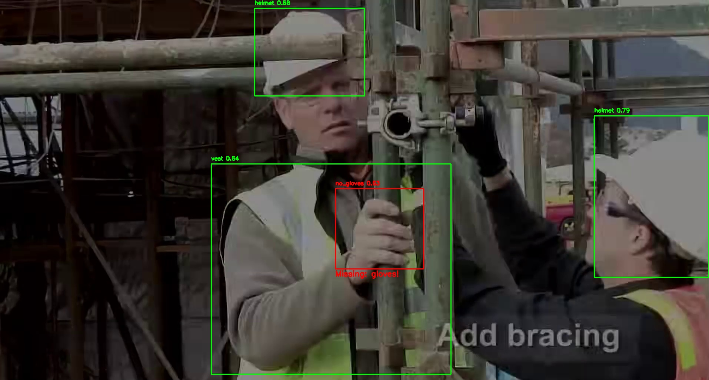

# AI-Powered PPE & Safety-Harness Detector  
**Real-time compliance monitoring for construction sites**

[](https://python.org)
[](https://ultralytics.com)
[](LICENSE)

Detects **workers** and verifies **PPE** (helmet, vest, gloves, boots, goggles).  
**Alerts** with **visual overlay + audio beep** when any item is missing.

---

The script uses data/beep.wav, models/best.pt, and a test video you provide.

## Installation Guide & Quick Start
1. Python 3.9+ – download
2. Git – download
3. Clone & install:
```bash
git clone https://github.com/Re-surgence/Safety-Harness-Detection.git
cd Safety-Harness-Detection
pip install -r requirements.txt
```
4. Run with any video (replace YOUR_VIDEO.mp4):
```bash
# Edit line 88 in src/ppe_realtime_alert.py
video_path = "YOUR_VIDEO.mp4"   # <-- put your file here
```
Then:
```bash
python src/ppe_realtime_alert.py
```
## Detection Results
| Compliant (Full PPE) | Non-Compliant (Missing Gloves) |
|:--------------------:|:------------------------------:|
|  |  |
- **Compliant image** – Vest, Helmet, Person detected (green boxes).
- **Non-Compliant image** – Gloves missing → red box + “Missing: gloves!” overlay.

> **Glove Limitation**
> - no_gloves is detected in only ~1/5 cases (low training data – 136 glove samples).
> - Plan: Add 100+ glove-missing images to improve recall.

## How Alerts Work
- Visual – Red box + text on the missing item.
- Audio – beep.wav plays on the first violation in a sequence.
- Saved frames –
  - saved_frames/compliant/ → clean workers
  - saved_frames/non_compliant/ → violations (filename includes missing items)
- CSV log – alerts_summary.csv lists every saved alert.

## Future Work
|Class|Issue|Plan|
|:---:|:---:|:---:|
|no_gloves|Low recall|Add glove-missing data|
|no_vest|Untested|Test on real violations|

**Contributions welcome!**
